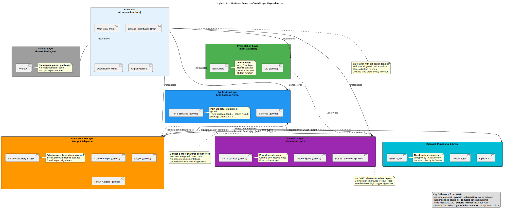
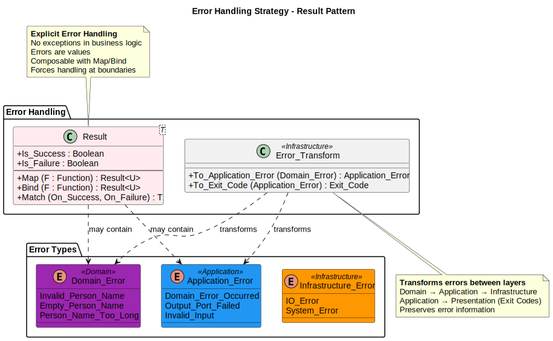
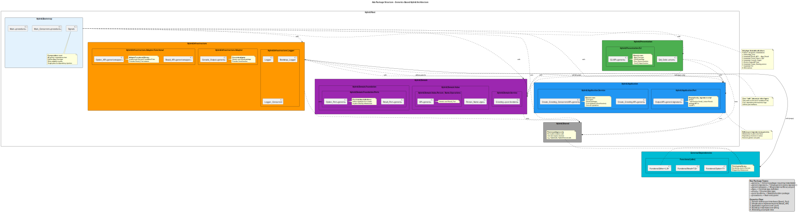
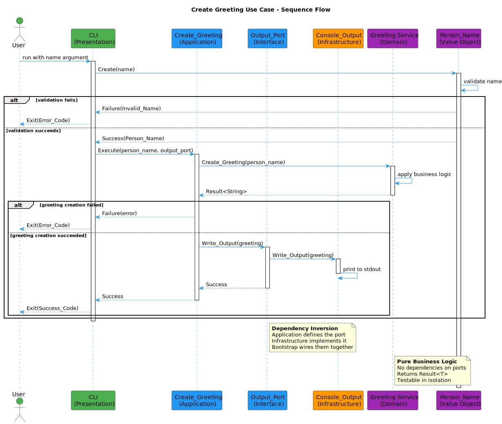

# Architecture Overview

**Version:** 1.0.0-rc2  
**Date:** November 16, 2025  
**SPDX-License-Identifier:** BSD-3-Clause
**License File:** See LICENSE file in the project root.
**Copyright:** © 2025 Michael Gardner, A Bit of Help, Inc.  
**Status:** Unreleased  

## Introduction

This Ada 2022 reference application demonstrates **Hexagonal Architecture (Ports & Adapters)** using **generic programming** instead of object-oriented inheritance. The architecture ensures business logic remains completely independent of technical details through compile-time dependency injection via Ada's powerful generic instantiation mechanism.

**Key Innovation**: This architecture uses **port-based generics** rather than interface inheritance, making dependencies explicit at compile time and eliminating runtime dispatch overhead.



## What Makes This Architecture Different?

### Traditional OOP Approach (What We Don't Use)
```ada
-- OLD WAY: Interface inheritance with runtime polymorphism
type Output_Port is interface;
procedure Send (Self : Output_Port; Msg : String) is abstract;

type Console_Output is new Output_Port with null record;
procedure Send (Self : Console_Output; Msg : String) is ...

-- Runtime dependency injection
Service.Execute (Name, Console_Output'Access);
```

### Generics-Based Approach (What We Use)
```ada
-- NEW WAY: Generic formal parameters with compile-time binding
generic
   with function Send (Msg : String) return Result is <>;
package Service is
   function Run (Name : String) return Result;
end Service;

-- Compile-time dependency injection via instantiation
package My_Service is new Service (Send => Console.Send);
```

**Why This Matters**:
- **Zero runtime overhead** - all bindings resolved at compile time
- **No vtables or dynamic dispatch** - direct function calls
- **Stronger type safety** - generics catch errors at instantiation time
- **Better inlining** - compiler can optimize across generic boundaries
- **Explicit dependencies** - every dependency visible in package spec

## Core Architectural Principles

### 1. Dependency Inversion via Generics

Instead of depending on abstract base classes, layers depend on **generic formal parameters**. The Domain and Application layers define what they need through generic signatures, and the Infrastructure layer provides concrete implementations.

**In Ada 2022 Generics:**
- Domain layer has **zero external dependencies**
- Application layer defines **port signatures** as generic formal parameters
- Infrastructure layer **instantiates** generics with concrete implementations
- Bootstrap layer wires everything via **successive generic instantiations**

```ada
-- Application defines WHAT it needs (port signature)
generic
   type Error_Type is private;
   with package Result_Port is new Result_Package (T => String, E => Error_Type);
   with function Send_Output (Msg : String) return Result_Port.Result is <>;
package Use_Case is
   function Execute (Input : String) return Result_Port.Result;
end Use_Case;

-- Infrastructure provides HOW (concrete implementation)
function Console_Send (Msg : String) return My_Result.Result is
begin
   Ada.Text_IO.Put_Line (Msg);
   return My_Result.Ok (...);
end Console_Send;

-- Bootstrap wires WHO to WHAT (composition root)
package My_Use_Case is new Use_Case
  (Error_Type  => App_Error,
   Result_Port => App_Result_Package,
   Send_Output => Console_Send);
```

### 2. Port Signatures Instead of Interfaces

**Ports** are not interface types—they are **generic package specifications with formal parameters**. Each port signature defines the contract that adapters must fulfill.

| Concept | OOP Version | Generic Version |
|---------|-------------|-----------------|
| **Port** | `type Output_Port is interface;` | `generic with function Send (...) is <>;` |
| **Adapter** | `type Console extends Output_Port` | `function Console_Send (...)` bound to port |
| **Dependency Injection** | Constructor injection with access types | Generic instantiation with function names |
| **Binding Time** | Runtime (dynamic dispatch) | Compile time (static resolution) |
| **Performance** | Virtual function call | Direct function call (inlined) |

**Example Port Signature**:
```ada
-- Port definition in Application layer
package Hybrid.Application.Port.Output is
   generic
      type App_Error is private;
      with package R is new Result_Port (T => Unbounded_String, E => App_Error);
      with function Send (Msg : String) return R.Result is <>;
   package API is
      -- Empty body - this is just a signature
   end API;
end Hybrid.Application.Port.Output;
```

### 3. Functional Error Handling with Result Types

The system uses the **Functional library** for type-safe error handling:

- **`Result<T, E>`** - represents Success(value) or Failure(error)
- **`Option<T>`** - represents Some(value) or None
- **`Either<L, R>`** - represents Left(value) or Right(value)

These are **generic packages** that get instantiated with specific types:

```ada
-- In Infrastructure, create Result adapters
package App_Result is new Functional.Result (T => Unbounded_String, E => App_Error);

-- Services use the Result port
generic
   with package R is new Result_Port (T => String, E => Error);
package My_Service is
   function Run (Input : String) return R.Result;
end My_Service;
```



### 4. Composition Root Pattern

The **Bootstrap** layer is the only place where concrete types meet. It instantiates all generics in the correct order, creating the dependency graph.

```ada
-- Bootstrap wiring (simplified)
procedure Main is
   -- Step 1: Instantiate Result adapters
   package App_Result is new Functional_Adapter.Result_API (T => String, E => App_Error);

   -- Step 2: Instantiate concrete adapters
   package Console_Adapter is new Console_Output (App_Error => App_Error, R => App_Result);

   -- Step 3: Instantiate ports with adapters
   package Output_Port is new Application.Port.Output.API
     (App_Error => App_Error, R => App_Result, Send => Console_Adapter.Send);

   -- Step 4: Instantiate service with ports
   package Greeting_Service is new Application.Service.Create_Greeting.API
     (App_Error => App_Error, R => App_Result, Output_Port => Output_Port);

   -- Step 5: Use the service
   Result : constant App_Result.Result := Greeting_Service.Run ("Alice");
begin
   ...
end Main;
```

## Architecture Layers

### Shared Layer - `Hybrid.*` (Parent Packages)

**Purpose**: Root package declarations that establish the namespace hierarchy.

**Characteristics:**
- **Empty package bodies** or simple declarations
- **No implementation** - purely organizational
- **Defines layer boundaries** through package hierarchy
- **Imported by all layers** for namespace access

**Components:**
```ada
Hybrid                        -- Root package
├── Hybrid.Domain             -- Domain layer root
├── Hybrid.Application        -- Application layer root
├── Hybrid.Infrastructure     -- Infrastructure layer root
├── Hybrid.Presentation       -- Presentation layer root
└── Hybrid.Bootstrap          -- Bootstrap layer root
```

**Why This Matters**: Ada requires parent packages to exist before child packages. These provide the namespace structure without creating circular dependencies.

### Domain Layer (Core) - `Hybrid.Domain`

The innermost layer containing pure business logic, implemented using **generic packages** for maximum reusability.

**Characteristics:**
- **Zero external dependencies** - not even `with` clauses to other layers
- **Generic over Result types** - doesn't know about specific Result implementations
- **Pure functions** - no I/O, no side effects
- **Type parameters** - Error types passed as generic formals

**Components:**
```ada
Hybrid.Domain
├── Foundation/
│   └── Ports/                    -- Generic port signatures
│       ├── Result_Port           -- Signature for Result<T,E>
│       ├── Option_Port           -- Signature for Option<T>
│       └── Either_Port           -- Signature for Either<L,R>
├── Value/
│   ├── Person_Name               -- Value object types
│   └── Person_Name.Operations    -- Generic operations over ports
└── Service/
    └── Greeting                  -- Domain services (generic)
```

**Example - Value Object with Generic Operations**:
```ada
-- Type definition (no generics here)
package Hybrid.Domain.Value.Person_Name is
   type Person_Name (Len : Natural) is private;
   function To_String (V : Person_Name) return String;
   type Person_Name_Error is (Bad_Input, Too_Long, Invalid_Chars);
private
   type Person_Name (Len : Natural) is record
      S : String (1 .. Len);
   end record;
end Hybrid.Domain.Value.Person_Name;

-- Operations (generic over Result port)
package Hybrid.Domain.Value.Person_Name.Operations is
   generic
      with package R is new Result_Port
        (T => Person_Name, E => Person_Name_Error, others => <>);
   package API is
      function Create (Raw : String) return R.Result;
   end API;
end Hybrid.Domain.Value.Person_Name.Operations;
```

**Key Insight**: The domain defines **what operations exist** but is generic over **how Results are created**. This achieves true dependency inversion.

### Application Layer - `Hybrid.Application`

Orchestrates use cases and defines **port signatures** that Infrastructure must implement.

**Characteristics:**
- **Depends only on Domain** (port signatures)
- **Generic over Error types** and Result implementations
- **Defines port contracts** as generic formal parameters
- **Services are generic packages** not tagged types

**Components:**
```ada
Hybrid.Application
├── Port/
│   └── Output                    -- Port signature (generic formal params)
└── Service/
    ├── Create_Greeting           -- Use case (generic over ports)
    └── Create_Greeting_Concurrent -- Concurrent version (Ada tasks)
```

**Example - Service Generic Over Ports**:
```ada
package Hybrid.Application.Service.Create_Greeting is
   generic
      -- Error types as formal parameters
      type App_Error is private;
      type Person_Name_Error is private;

      -- Error mapping function
      with function Map_Error (E : Person_Name_Error) return App_Error is <>;

      -- Result ports
      with package R is new Result_Port (T => Unbounded_String, E => App_Error);
      with package R_Name is new Result_Port (T => Person_Name, E => Person_Name_Error);

      -- Domain operations
      with package Name_Ops is new Person_Name.Operations.API (R => R_Name);

      -- Output port
      with package Output_Port is new Application.Port.Output.API
        (App_Error => App_Error, R => R, others => <>);

   package API is
      function Run (Raw_Name : String) return R.Result;
   end API;
end Hybrid.Application.Service.Create_Greeting;
```

**What This Achieves**:
- Service knows **what operations it needs** (Name_Ops, Output_Port)
- Service doesn't know **who provides them** (decided at instantiation)
- All dependencies are **compile-time checked**
- No runtime overhead for dependency resolution

### Infrastructure Layer - `Hybrid.Infrastructure`

Provides **concrete implementations** that get bound to ports via generic instantiation.

**Characteristics:**
- **Depends on Application** (knows about port signatures)
- **Provides concrete adapters** (implementations of port functions)
- **Instantiates Functional library** to create Result types
- **Handles all I/O** (console, file, network, database)

**Components:**
```ada
Hybrid.Infrastructure
├── Adapter/
│   ├── Functional/               -- Result/Option/Either adapters
│   │   ├── Result_API            -- Instantiates Functional.Result
│   │   ├── Option_API            -- Instantiates Functional.Option
│   │   └── Either_API            -- Instantiates Functional.Either
│   └── Console_Output            -- Console adapter (generic over Result)
└── Logger                        -- Logging infrastructure
```

**Example - Adapter Implementation**:
```ada
-- Console adapter is itself generic over Result type
generic
   type App_Error is private;
   with package R is new Result_Port (T => Unbounded_String, E => App_Error);
   IO_Failure : App_Error;  -- Error to return on I/O failure
package Hybrid.Infrastructure.Adapter.Console_Output is
   function Send (Msg : String) return R.Result;
end Hybrid.Infrastructure.Adapter.Console_Output;

-- Implementation
package body Hybrid.Infrastructure.Adapter.Console_Output is
   function Send (Msg : String) return R.Result is
   begin
      Ada.Text_IO.Put_Line (Msg);
      return R.Ok (To_Unbounded_String (Msg));
   exception
      when others =>
         return R.Err (IO_Failure);
   end Send;
end Hybrid.Infrastructure.Adapter.Console_Output;
```

**Key Insight**: Even adapters are generic! They get instantiated with specific Result types in Bootstrap.

### Presentation Layer - `Hybrid.Presentation`

Handles user interaction, implemented as **generic packages** over service signatures.

**Characteristics:**
- **Generic over services** - doesn't depend on concrete implementations
- **Provides CLI argument parsing** (--help, --version, --quiet)
- **Maps Results to exit codes** for the operating system
- **Handles user-facing error messages**

**Components:**
```ada
Hybrid.Presentation
├── CLI                           -- Generic CLI handler
└── Exit_Code                     -- Exit code enumeration
```

**Example - Generic CLI**:
```ada
package Hybrid.Presentation.CLI is
   generic
      type App_Error is private;
      with package R is new Result_Port (T => Unbounded_String, E => App_Error);
      with function Run_Service (Name : String) return R.Result is <>;
      with function Send_Output (Msg : String) return R.Result is <>;
   package API is  -- Note: Not a tagged type!
      function Run return Exit_Code.Exit_Code_Type;
   end API;
end Hybrid.Presentation.CLI;
```

### Bootstrap Layer - `Hybrid.Bootstrap`

The **composition root** where all generic instantiations happen.

**Characteristics:**
- **Only layer depending on all others**
- **No generics** at this layer - pure instantiation
- **Creates concrete instances** via generic instantiation chain
- **Wires dependencies** by passing instantiated packages to other generics

**Example - Complete Wiring** (from hybrid-bootstrap-main.adb):
```ada
procedure Hybrid.Bootstrap.Main is
   -- Step 1: Define error types
   type App_Error is (Bad_Input, IO_Error, System_Error);

   -- Step 2: Instantiate Result adapters
   package App_Result is new Infrastructure.Adapter.Functional.Result_API
     (T => Unbounded_String, E => App_Error);

   package Person_Name_Result is new Infrastructure.Adapter.Functional.Result_API
     (T => Domain.Value.Person_Name.Person_Name,
      E => Domain.Value.Person_Name.Person_Name_Error);

   -- Step 3: Instantiate domain operations
   package Person_Name_Ops is new Domain.Value.Person_Name.Operations.API
     (R => Person_Name_Result.Instance);

   -- Step 4: Instantiate adapters
   package Console_Out is new Infrastructure.Adapter.Console_Output
     (App_Error => App_Error, R => App_Result.Instance, IO_Failure => IO_Error);

   -- Step 5: Bind adapter to port
   package Output_Port is new Application.Port.Output.API
     (App_Error => App_Error, R => App_Result.Instance, Send => Console_Out.Send);

   -- Step 6: Map errors between layers
   function Map_Person_Name_Error (E : Person_Name_Error) return App_Error is (Bad_Input);

   -- Step 7: Instantiate service with all dependencies
   package Greeting_Service is new Application.Service.Create_Greeting.API
     (App_Error         => App_Error,
      Person_Name_Error => Person_Name_Error,
      Map_Error         => Map_Person_Name_Error,
      R                 => App_Result.Instance,
      R_Name            => Person_Name_Result.Instance,
      Name_Ops          => Person_Name_Ops,
      Output_Port       => Output_Port);

   -- Step 8: Instantiate CLI
   package CLI is new Presentation.CLI
     (App_Error   => App_Error,
      R           => App_Result.Instance,
      Run_Service => Greeting_Service.Run,
      Send_Output => Console_Out.Send);

   App_Exit_Code : Exit_Code.Exit_Code_Type;
begin
   App_Exit_Code := CLI.Run;
   Ada.Command_Line.Set_Exit_Status (Ada.Command_Line.Exit_Status (App_Exit_Code));
end Hybrid.Bootstrap.Main;
```

**What Happens Here**:
1. Error types defined once
2. Result adapters instantiated (bind Functional library)
3. Domain operations instantiated with Result types
4. Infrastructure adapters instantiated
5. Ports bound to adapters
6. Services instantiated with all dependencies
7. CLI instantiated with services

**Result**: A complete dependency graph resolved at **compile time** with **zero runtime overhead**.

## Generic Instantiation Flow

```
1. Define Error Types (App_Error, Domain_Error)
         ↓
2. Instantiate Result_API<T, E> → Creates Result types
         ↓
3. Instantiate Domain.Operations<Result>
         ↓
4. Instantiate Infrastructure Adapters<Result>
         ↓
5. Bind Adapters to Application Ports
         ↓
6. Instantiate Services<Ports, Operations>
         ↓
7. Instantiate Presentation<Services>
         ↓
8. Execute
```

Each step produces a **package instance** that is passed to the next step.

## Package Dependencies (Compile-Time)



**Enforced by GPRbuild**:

```ada
-- shared/shared.gpr: Parent packages only
library project Shared is
   for Source_Dirs use ("src");
   for Library_Name use "shared";
end Shared;

-- domain/domain.gpr: NO dependencies except shared
with "../shared/shared.gpr";
library project Domain is
   for Source_Dirs use ("src");
   for Library_Name use "domain";
end Domain;

-- application/application.gpr: Domain + Shared
with "../domain/domain.gpr";
with "../shared/shared.gpr";
library project Application is
end Application;

-- infrastructure/infrastructure.gpr: Application + Domain + Shared + Functional
with "../application/application.gpr";
with "../domain/domain.gpr";
with "../shared/shared.gpr";
with "functional";  -- External library
library project Infrastructure is
end Infrastructure;

-- presentation/presentation.gpr: Application + Shared
with "../application/application.gpr";
with "../shared/shared.gpr";
project Presentation is
end Presentation;

-- bootstrap/bootstrap.gpr: Everything
with "../domain/domain.gpr";
with "../application/application.gpr";
with "../infrastructure/infrastructure.gpr";
with "../presentation/presentation.gpr";
with "../shared/shared.gpr";
project Bootstrap is
end Bootstrap;
```

## Use Case Flow Example



**Create Greeting Use Case Flow**:

1. **User** runs `./hybrid-bootstrap-main Alice`
2. **CLI.Run()** (instantiated generic)
   - Parses arguments
   - Calls `Run_Service("Alice")` (bound to Greeting_Service.Run)
3. **Greeting_Service.Run()** (instantiated generic)
   - Calls `Name_Ops.Create("Alice")` → `Result<Person_Name, Error>`
   - If Ok: extracts Person_Name value
   - Constructs greeting: `"Hello, Alice!"`
   - Returns `Result.Ok(greeting)`
4. **CLI.Run()**
   - Receives `Result<String, Error>`
   - If Ok and not --quiet: prints greeting
   - Returns exit code
5. **Main** sets exit status

**Key Points**:
- No dynamic dispatch - all calls are direct
- No access types - all bindings via generic parameters
- Errors explicit in return types
- Each layer knows only what it needs (port signatures)

## Comparison with OOP Architecture

| Aspect | OOP (Old) | Generics (New) |
|--------|-----------|----------------|
| **Port Definition** | `type Port is interface;` | `generic with function ... is <>;` |
| **Adapter Implementation** | `type Adapter is new Port with ...` | `function Adapter_Impl (...) return ...` |
| **Dependency Injection** | Constructor with access parameters | Generic instantiation with function parameters |
| **Binding Time** | Runtime (via access-to-class) | Compile time (generic instantiation) |
| **Dispatch Mechanism** | Virtual function table (vtable) | Direct function call |
| **Performance** | Indirect call through vtable | Inlined direct call |
| **Memory** | Heap allocation for objects | Stack allocation or inlined |
| **Type Safety** | Checked at subtype derivation | Checked at generic instantiation |
| **Dependencies** | Hidden in implementation | Explicit in generic signature |
| **Testing** | Requires mock objects | Pure functions, no mocking needed |

**Why Generics Win**:
- **Zero abstraction cost** - no runtime overhead
- **Better optimization** - compiler sees through generic boundaries
- **Explicit contracts** - all dependencies in package spec
- **Compile-time errors** - catch mistakes earlier
- **No heap allocation** - everything can be stack-based
- **Functional style** - easier to reason about, compose, and test

## Ada 2022 Features Used

- **`pragma Ada_2022;`** - All source files use Ada 2022
- **Generic Packages** - Extensive use for dependency injection
- **Generic Formal Packages** - Ports passed as `with package` parameters
- **Generic Formal Functions** - Functions passed as `with function` parameters
- **Default Generic Parameters** - `others => <>` for convenience
- **Tasks** - Concurrent service implementations
- **Protected Types** - Thread-safe logging
- **Unbounded_String** - Used because Result<T> requires definite types

## Testing Strategy

Generics make testing even easier:

- **Unit Tests** - Domain pure functions, no dependencies
- **Integration Tests** - Instantiate with test adapters (in-memory)
- **Property Tests** - Same service, multiple adapter combinations
- **No Mocking** - Services are pure, adapters are simple functions

## Benefits of This Architecture

1. **Zero Runtime Overhead** - All dependency resolution at compile time
2. **Type Safety** - Generic instantiation catches mismatches
3. **Explicit Dependencies** - Every dependency visible in spec
4. **Better Optimization** - Compiler can inline across layers
5. **Testability** - Pure functions, simple adapters
6. **Maintainability** - Clear boundaries, explicit contracts
7. **Flexibility** - Swap adapters by changing instantiation
8. **Scalability** - Add new adapters without changing services
9. **Functional Style** - Easier to reason about, compose, test
10. **Ada Strength** - Leverages Ada's best feature (generics)

## Limitations and Trade-offs

While the generics-based approach provides significant benefits, it comes with important constraints and challenges that developers need to understand:

### 1. **Definite Types Required for Generic Parameters**

**The Issue**: Generic formal type parameters in Ada must be *definite types* - types with a known size at compile time. This means you **cannot** use unconstrained types like `String` directly.

```ada
-- ❌ DOES NOT COMPILE
generic
   type T is private;  -- String is indefinite (unknown length)
package Result_Port is
   type Result is ...
end Result_Port;

package String_Result is new Result_Port (T => String);  -- ERROR!
```

**The Solution**: Use definite types like `Unbounded_String`, `Bounded_String`, or constrained subtypes:

```ada
-- ✅ WORKS
with Ada.Strings.Unbounded;
package String_Result is new Result_Port
  (T => Ada.Strings.Unbounded.Unbounded_String);
```

**Impact**: Throughout the codebase, you'll see `Unbounded_String` used extensively instead of `String`. This adds conversion overhead and makes the code slightly more verbose:

```ada
-- Convert to/from String
use Ada.Strings.Unbounded;
Name : Unbounded_String := To_Unbounded_String ("Alice");
Msg  : String := To_String (Name);
```

### 2. **Complex Generic Instantiation Chains**

**The Issue**: Each layer requires its own generic instantiation, creating long dependency chains:

```ada
-- Step 1: Instantiate Result at Infrastructure
package App_Result is new Infrastructure.Adapter.Functional.Result_API
  (T => Unbounded_String, E => App_Error);

-- Step 2: Pass Result to Output Adapter
package Console_Out is new Infrastructure.Adapter.Console_Output
  (App_Error => App_Error, R => App_Result.Instance);

-- Step 3: Bind Console to Port
package Output_Port is new Application.Port.Output.API
  (App_Error => App_Error, R => App_Result.Instance, Send => Console_Out.Send);

-- Step 4: Pass Port to Service
package Greeting_Service is new Application.Service.Create_Greeting.API
  (App_Error => App_Error, R => App_Result.Instance, Output_Port => Output_Port);

-- Step 5: Pass Service to CLI
package CLI is new Presentation.CLI
  (App_Error => App_Error, R => App_Result.Instance, Run_Service => Greeting_Service.Run);
```

**Impact**: Bootstrap modules become verbose with extensive instantiation code. Each addition requires updating the entire chain.

### 3. **Compile-Time Lock-In**

**The Issue**: All dependencies are bound at compile time. You **cannot** switch implementations at runtime:

```ada
-- Cannot do this:
if Debug_Mode then
   Service.Use_Output (Debug_Console);  -- ❌ Runtime choice not possible
else
   Service.Use_Output (Production_Console);
end if;
```

**Workaround**: Create separate executable builds or use configuration generics:

```ada
-- Separate builds for different configurations
package Production_Main is new Main (Output => Console_Output);
package Debug_Main is new Main (Output => Debug_Output);
```

**Impact**: Less flexibility for runtime configuration. Testing different adapters requires recompilation.

### 4. **Error Message Complexity**

**The Issue**: Generic instantiation errors can be cryptic, especially with nested generics:

```
error: actual for "R" must be an instance of "Result_Port"
note: expected signature package with function Ok (T) return Result
note: found signature package with function Ok (String) return Result
note: type mismatch: Unbounded_String vs String
```

**Impact**: Debugging instantiation issues requires understanding the entire generic chain. Junior developers may struggle initially.

### 5. **No Dynamic Polymorphism**

**The Issue**: You cannot store heterogeneous collections of different adapter implementations:

```ada
-- ❌ Cannot do this:
type Output_List is array (1 .. 10) of access Output_Port'Class;  -- No 'Class!
```

**Workaround**: Use multiple named instances or switch to OOP for that specific component:

```ada
-- Multiple named instances
Console_1 : constant := Console_Out_1.Send'Access;
Console_2 : constant := Console_Out_2.Send'Access;
```

**Impact**: Patterns like Strategy, Plugin, or Factory are harder to implement purely with generics.

### 6. **Increased Code Size**

**The Issue**: Each generic instantiation creates a new copy of the code, potentially increasing binary size:

```ada
-- Three instantiations = three copies of the code
package Int_Result is new Result_API (T => Integer, E => Error);
package String_Result is new Result_API (T => Unbounded_String, E => Error);
package Float_Result is new Result_API (T => Float, E => Error);
```

**Mitigation**: Compiler optimizations often inline and deduplicate identical instantiations, but code size may still be larger than OOP.

**Impact**: For applications with many instantiations, binary size may increase noticeably.

### 7. **Testing Challenges**

**The Issue**: You cannot easily "mock" a generic dependency at runtime. Test doubles must be provided at instantiation:

```ada
-- Test configuration requires separate instantiation
package Test_Service is new Service
  (Output_Port => Mock_Output);  -- Mock bound at compile time

package Prod_Service is new Service
  (Output_Port => Real_Output);  -- Real bound at compile time
```

**Workaround**: Create test-specific generic instantiations in test code.

**Impact**: More verbose test setup compared to runtime dependency injection.

### 8. **Learning Curve**

**The Issue**: Understanding generic formal parameters, formal packages, and default parameters (`others => <>`) requires solid knowledge of Ada's generic system.

**Example confusion**:
```ada
with package R is new Result_Port (T => String, E => Error, others => <>);
--                                                           ^^^^^^^^^^^^
-- What does "others => <>" mean? (Answer: use defaults for all other generics)
```

**Impact**: Steeper onboarding for developers unfamiliar with advanced Ada generics.

### Summary: When to Use Generics vs OOP

| Scenario | Use Generics | Use OOP |
|----------|--------------|---------|
| Performance critical | ✅ Yes | ❌ No (vtable overhead) |
| Known types at compile time | ✅ Yes | Either works |
| Runtime polymorphism needed | ❌ No | ✅ Yes |
| Plugin architecture | ❌ Difficult | ✅ Yes |
| Heterogeneous collections | ❌ No | ✅ Yes |
| Maximum type safety | ✅ Yes | Either works |
| Simple dependency injection | Either works | ✅ Easier |

**Bottom Line**: The generics approach trades *runtime flexibility* for *compile-time safety and performance*. It's ideal for well-defined architectures with known component types, but OOP may be better for highly dynamic or plugin-based systems.

## Next Steps

- **[Generics vs OOP Patterns](generics-vs-oop.md)** - Detailed comparison
- **[Port/Adapter Pattern Guide](ports-and-adapters.md)** - Implementation patterns
- **[Domain Layer Guide](domain-layer.md)** - Pure business logic
- **[Application Layer Guide](application-layer.md)** - Use cases and ports
- **[Infrastructure Layer Guide](infrastructure-layer.md)** - Adapters and I/O
- **[Bootstrap Guide](bootstrap-module.md)** - Dependency wiring
- **[Functional Types Guide](functional-types-tutorial.md)** - Result/Option/Either

## References

- **Ada 2022 Generics** - ARM 12: Generic Units
- **Hexagonal Architecture** - Alistair Cockburn
- **Dependency Inversion Principle** - Robert C. Martin
- **Functional Error Handling** - Railway-Oriented Programming
- **Domain-Driven Design** - Eric Evans
