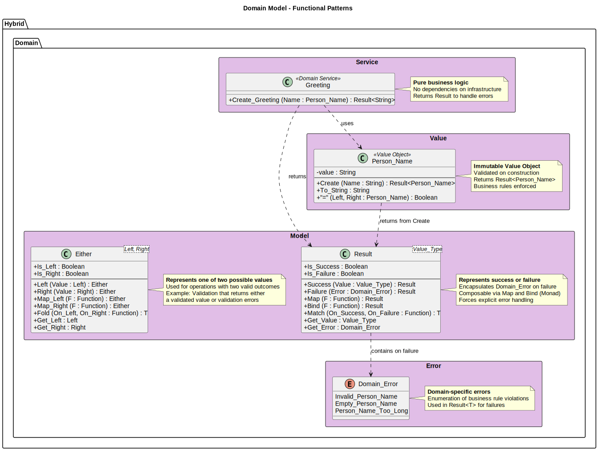

# Domain Layer Guide

**Version:** 1.0.0-rc2  
**Date:** November 16, 2025  
**SPDX-License-Identifier:** BSD-3-Clause
**License File:** See LICENSE file in the project root.
**Copyright:** © 2025 Michael Gardner, A Bit of Help, Inc.  
**Status:** Unreleased  

## What is the Domain Layer?

The Domain Layer is the **heart of the application** - it contains all the business logic that makes your application unique. It's the "brain" that encodes all business rules, validations, and decisions.

**Core Principle**: The Domain Layer has **zero dependencies** on other architectural layers. It doesn't know about databases, UIs, or external services. This makes it:
- **Pure** - No side effects, no I/O
- **Testable** - No mocking required
- **Portable** - Can be reused anywhere
- **Maintainable** - Easy to understand and modify



## Key Characteristics

### 1. No External Dependencies

The Domain Layer is completely self-contained:

```ada
-- domain.gpr - Notice: NO "with" clauses to other layers
library project Domain is
   for Library_Name use "Domain";
   for Source_Dirs use ("src/**");
   -- Self-contained - no dependencies on Application, Infrastructure, etc.
end Domain;
```

This is enforced at compile-time by GPRbuild. If you try to add a `with "application.gpr"`, the build fails.

### 2. Pure Business Logic

Domain functions are **pure** - same inputs always produce same outputs, no side effects:

```ada
-- ✓ GOOD: Pure function, no I/O, deterministic
function Create_Greeting (Name : Person_Name) return Result.Result is
begin
   return Result.Success ("Hello, " & Name.To_String & "!");
end Create_Greeting;

-- ✗ BAD: I/O in domain layer (belongs in Infrastructure)
function Create_Greeting (Name : Person_Name) return Result.Result is
begin
   Ada.Text_IO.Put_Line ("Creating greeting...");  -- NO! I/O doesn't belong here
   return Result.Success ("Hello, " & Name.To_String & "!");
end Create_Greeting;
```

### 3. Explicit Error Handling

Domain Layer uses **Result** and **Either** types instead of exceptions:

```ada
-- ✓ GOOD: Explicit error handling with Result
function Create (Name : String) return Result.Result is
begin
   if Name'Length = 0 then
      return Result.Failure (Domain_Error.Empty_Person_Name);
   elsif Name'Length > 100 then
      return Result.Failure (Domain_Error.Person_Name_Too_Long);
   else
      return Result.Success (Person_Name'(Value => Name));
   end if;
end Create;

-- ✗ BAD: Using exceptions (violates functional error handling)
function Create (Name : String) return Person_Name is
begin
   if Name'Length = 0 then
      raise Constraint_Error with "Name cannot be empty";  -- NO!
   end if;
   return Person_Name'(Value => Name);
end Create;
```

## Domain Layer Components

### 1. Value Objects (`Hybrid.Domain.Value`)

**Value Objects** are immutable, validated types that represent domain concepts.

**Characteristics:**
- Immutable after creation
- Validated on construction
- Self-contained validation rules
- Equality based on value, not identity

**Example - Person_Name:**

Location: `domain/src/value/hybrid-domain-value-person_name.ads`

```ada
package Hybrid.Domain.Value.Person_Name is

   type Person_Name is private;

   -- Smart constructor - validates and returns Result
   function Create (Name : String) return Result.Result;

   -- Safe accessor
   function To_String (Self : Person_Name) return String;

   -- Value equality
   function "=" (Left, Right : Person_Name) return Boolean;

private
   type Person_Name is record
      Value : Unbounded_String;
   end record;

end Hybrid.Domain.Value.Person_Name;
```

**Why use Value Objects instead of plain Strings?**

```ada
-- ✗ BAD: Primitive obsession - no validation, error-prone
procedure Process_User (Name : String; Email : String) is
begin
   -- Which is which? Easy to swap parameters!
   Send_Email (Email, Name);  -- Oops! Wrong order
end Process_User;

-- ✓ GOOD: Type safety, validated on construction
procedure Process_User (Name : Person_Name; Email : Email_Address) is
begin
   Send_Email (Email, Name);  -- Compiler error if order is wrong!
   -- Plus: we KNOW Name and Email are valid because they were validated on creation
end Process_User;
```

### 2. Domain Services (`Hybrid.Domain.Service`)

**Domain Services** contain business logic that doesn't naturally fit in a value object.

**When to use Domain Services:**
- Operations involving multiple value objects
- Business rules that aren't the responsibility of a single entity
- Stateless operations

**Example - Greeting Service:**

Location: `domain/src/service/hybrid-domain-service-greeting.ads`

```ada
package Hybrid.Domain.Service.Greeting is

   -- Pure business logic: creates greeting message
   function Create_Greeting (Name : Person_Name) return Result.Result;

end Hybrid.Domain.Service.Greeting;
```

Implementation (`.adb`):
```ada
function Create_Greeting (Name : Person_Name) return Result.Result is
   Message : constant String := "Hello, " & Name.To_String & "!";
begin
   -- Business rule: greeting must be non-empty
   if Message'Length = 0 then
      return Result.Failure (Domain_Error.Invalid_Greeting);
   end if;

   return Result.Success (Message);
end Create_Greeting;
```

### 3. Functional Types (`Hybrid.Domain.Model`)

The Domain Layer uses **monadic types** for composable error handling.

#### Result<T> Monad

**Purpose**: Represents either Success(value) or Failure(error)

Location: `domain/src/model/hybrid-domain-model-result.ads`

```ada
generic
   type Value_Type is private;
package Hybrid.Domain.Model.Result is

   type Result is private;

   -- Constructors
   function Success (Value : Value_Type) return Result;
   function Failure (Error : Domain_Error) return Result;

   -- Query functions
   function Is_Success (Self : Result) return Boolean;
   function Is_Failure (Self : Result) return Boolean;

   -- Accessors (raise exception if wrong variant - use pattern matching!)
   function Get_Value (Self : Result) return Value_Type;
   function Get_Error (Self : Result) return Domain_Error;

   -- Functor: Map transforms the success value
   generic
      type New_Type is private;
      with function Transform (Value : Value_Type) return New_Type;
   function Map (Self : Result) return Result_New;

   -- Monad: Bind chains operations that return Result
   generic
      type New_Type is private;
      with function Transform (Value : Value_Type) return Result_New;
   function Bind (Self : Result) return Result_New;

   -- Pattern matching
   generic
      type Return_Type is private;
      with function On_Success (Value : Value_Type) return Return_Type;
      with function On_Failure (Error : Domain_Error) return Return_Type;
   function Match (Self : Result) return Return_Type;

end Hybrid.Domain.Model.Result;
```

**How to use Result:**

```ada
-- Pattern matching (recommended - safe)
procedure Process_Name (Input : String) is
   Name_Result : constant Result.Result := Person_Name.Create (Input);

   function Handle_Success (Name : Person_Name) return Exit_Code is
   begin
      Ada.Text_IO.Put_Line ("Valid name: " & Name.To_String);
      return Success_Code;
   end Handle_Success;

   function Handle_Failure (Error : Domain_Error) return Exit_Code is
   begin
      Ada.Text_IO.Put_Line ("Error: " & Error'Image);
      return Error_Code;
   end Handle_Failure;

   Exit_Status : constant Exit_Code := Name_Result.Match (
      On_Success => Handle_Success'Access,
      On_Failure => Handle_Failure'Access
   );
begin
   Ada.Command_Line.Set_Exit_Status (Exit_Status);
end Process_Name;

-- Chaining operations with Map/Bind
function Create_And_Greet (Input : String) return Result.Result is
   Name_Result : constant Result.Result := Person_Name.Create (Input);
begin
   -- Map: Transform Person_Name → Greeting without unwrapping Result
   return Name_Result.Bind (Greeting.Create_Greeting'Access);
end Create_And_Greet;
```

#### Either<L,R> Monad

**Purpose**: Represents one of two valid outcomes (not necessarily error cases)

Location: `domain/src/model/hybrid-domain-model-either.ads`

```ada
generic
   type Left_Type is private;
   type Right_Type is private;
package Hybrid.Domain.Model.Either is

   type Either is private;

   -- Constructors
   function Left (Value : Left_Type) return Either;
   function Right (Value : Right_Type) return Either;

   -- Query functions
   function Is_Left (Self : Either) return Boolean;
   function Is_Right (Self : Either) return Boolean;

   -- Accessors
   function Get_Left (Self : Either) return Left_Type;
   function Get_Right (Self : Either) return Right_Type;

   -- Functors for each side
   generic
      type New_Type is private;
      with function Transform (Value : Left_Type) return New_Type;
   function Map_Left (Self : Either) return Either_New;

   generic
      type New_Type is private;
      with function Transform (Value : Right_Type) return New_Type;
   function Map_Right (Self : Either) return Either_New;

   -- Fold: combine both sides into single value
   generic
      type Return_Type is private;
      with function On_Left (Value : Left_Type) return Return_Type;
      with function On_Right (Value : Right_Type) return Return_Type;
   function Fold (Self : Either) return Return_Type;

end Hybrid.Domain.Model.Either;
```

**When to use Either vs Result:**

```ada
-- Use Result when one side is always an error
type Validation_Result is new Result (Value_Type => Person_Name);

-- Use Either when both sides are valid outcomes
type Cached_Or_Fresh is new Either (
   Left_Type  => Cached_Data,
   Right_Type => Fresh_Data
);
```

### 4. Domain Errors (`Hybrid.Domain.Error`)

**Domain Errors** enumerate all possible business rule violations.

Location: `domain/src/error/hybrid-domain-error.ads`

```ada
package Hybrid.Domain.Error is

   type Domain_Error is (
      Invalid_Person_Name,
      Empty_Person_Name,
      Person_Name_Too_Long,
      Invalid_Greeting
   );

   -- Convert to human-readable message
   function To_String (Error : Domain_Error) return String;

end Hybrid.Domain.Error;
```

**Why use enumerations instead of exception types?**

1. **Exhaustive pattern matching** - Compiler ensures all cases handled
2. **No stack unwinding** - More efficient than exceptions
3. **Composable** - Can be transformed between layers
4. **Explicit in type signatures** - `Result` shows function can fail

## Package Organization

```
domain/
├── domain.gpr                              -- Project file (no dependencies!)
└── src/
    ├── hybrid-domain.ads                   -- Root package
    ├── error/
    │   ├── hybrid-domain-error.ads         -- Domain_Error enumeration
    │   └── hybrid-domain-error.adb
    ├── model/
    │   ├── hybrid-domain-model.ads         -- Model root package
    │   ├── hybrid-domain-model-result.ads  -- Result<T> monad
    │   ├── hybrid-domain-model-result.adb
    │   ├── hybrid-domain-model-either.ads  -- Either<L,R> monad
    │   └── hybrid-domain-model-either.adb
    ├── value/
    │   ├── hybrid-domain-value.ads         -- Value objects root
    │   ├── hybrid-domain-value-person_name.ads
    │   └── hybrid-domain-value-person_name.adb
    └── service/
        ├── hybrid-domain-service.ads       -- Services root
        ├── hybrid-domain-service-greeting.ads
        └── hybrid-domain-service-greeting.adb
```

## Testing Domain Logic

Domain Layer is the **easiest to test** because it's pure:

```ada
-- tests/unit/src/domain/test_domain_value_person_name.adb

procedure Test_Create_Valid_Name is
   Name_Result : constant Result.Result := Person_Name.Create ("Alice");
begin
   Assert (Name_Result.Is_Success, "Should succeed for valid name");
   Assert (Name_Result.Get_Value.To_String = "Alice", "Should preserve name");
end Test_Create_Valid_Name;

procedure Test_Create_Empty_Name is
   Name_Result : constant Result.Result := Person_Name.Create ("");
begin
   Assert (Name_Result.Is_Failure, "Should fail for empty name");
   Assert (Name_Result.Get_Error = Empty_Person_Name, "Should return correct error");
end Test_Create_Empty_Name;

procedure Test_Create_Long_Name is
   Long_Name : constant String := (1 .. 101 => 'A');
   Name_Result : constant Result.Result := Person_Name.Create (Long_Name);
begin
   Assert (Name_Result.Is_Failure, "Should fail for too-long name");
   Assert (Name_Result.Get_Error = Person_Name_Too_Long, "Should return correct error");
end Test_Create_Long_Name;
```

**No mocking needed!** Domain tests are fast, deterministic, and require no setup.

## Design Patterns in the Domain

### 1. Smart Constructors

Don't expose the actual type, only validated instances:

```ada
type Person_Name is private;  -- Hide internal representation

function Create (Name : String) return Result.Result;  -- Only way to create

private
   type Person_Name is record
      Value : Unbounded_String;  -- Internal detail
   end record;
```

### 2. Make Illegal States Unrepresentable

Use Ada's type system to prevent invalid data:

```ada
-- ✗ BAD: Can create invalid Person_Name
type Person_Name is record
   Value : Unbounded_String;  -- Public! Can be set to anything
end record;

Name : Person_Name := (Value => To_Unbounded_String (""));  -- Invalid!

-- ✓ GOOD: Can only create valid Person_Name
type Person_Name is private;  -- Must use Create function

function Create (Name : String) return Result.Result;  -- Validates!
```

### 3. No Primitive Obsession

Wrap primitives in domain types:

```ada
-- ✗ BAD: Using primitives everywhere
procedure Send_Email (To_Address : String; From_Address : String; Body : String);

-- Easy to mix up parameters! Compiler won't catch this:
Send_Email (Body, To_Address, From_Address);  -- Compiles but wrong!

-- ✓ GOOD: Domain types prevent errors
procedure Send_Email (To : Email_Address; From : Email_Address; Body : Email_Body);

-- Compiler error if parameters are swapped:
Send_Email (Body, To, From);  -- Compile error!
```

## Benefits of Pure Domain Layer

1. **Easy Testing** - No mocking, no database, no setup
2. **Fast Tests** - Pure functions execute in nanoseconds
3. **Portable** - Can be reused in different applications
4. **Understandable** - Business logic in one place
5. **Refactorable** - Change implementation without breaking other layers
6. **Type-Safe** - Ada compiler prevents many bugs

## Common Mistakes to Avoid

### ❌ Don't: Add I/O to Domain Layer

```ada
-- WRONG: I/O in domain
function Create_Greeting (Name : Person_Name) return Result.Result is
begin
   Ada.Text_IO.Put_Line ("Creating greeting...");  -- NO!
   return Result.Success ("Hello, " & Name.To_String & "!");
end Create_Greeting;
```

**Why?** I/O makes testing hard, creates side effects, couples to infrastructure.

### ❌ Don't: Use Exceptions for Business Logic

```ada
-- WRONG: Exceptions for business rules
function Create (Name : String) return Person_Name is
begin
   if Name'Length = 0 then
      raise Constraint_Error;  -- NO!
   end if;
end Create;
```

**Why?** Exceptions are for exceptional situations, not business rules. Use Result.

### ❌ Don't: Depend on Other Layers

```ada
-- WRONG: Domain depending on Infrastructure
with Hybrid.Infrastructure.Logger;  -- NO! This violates the architecture

package Hybrid.Domain.Service.Greeting is
   procedure Create_Greeting (Name : Person_Name);
end Hybrid.Domain.Service.Greeting;
```

**Why?** Domain must be self-contained. Let the Infrastructure depend on Domain, not the reverse.

### ❌ Don't: Put Business Logic in Application Layer

```ada
-- WRONG: Business logic in Application layer
function Execute (Name : String; Output : Output_Port) return Result is
begin
   if Name'Length > 100 then  -- Business rule! Should be in Domain
      return Failure (Error);
   end if;
end Execute;
```

**Why?** Business rules belong in Domain. Application orchestrates, Domain implements rules.

## Summary

The Domain Layer is your application's **source of truth**:

- **Pure business logic** - No I/O, no side effects
- **Zero dependencies** - Completely self-contained
- **Functional error handling** - Result and Either instead of exceptions
- **Type-safe** - Value objects prevent invalid states
- **Highly testable** - No mocking required

**Remember**: If it's a business rule, it belongs in the Domain Layer. Everything else is infrastructure.

## Next Steps

- **[Application Layer Guide](application-layer.md)** - Learn how to orchestrate domain logic
- **[Architecture Overview](architecture-overview.md)** - Understand the full architecture
- **[Testing Guide](testing.md)** - Test domain logic effectively

## References

- `domain/` - Domain layer source code
- `tests/unit/src/domain/` - Domain unit tests
