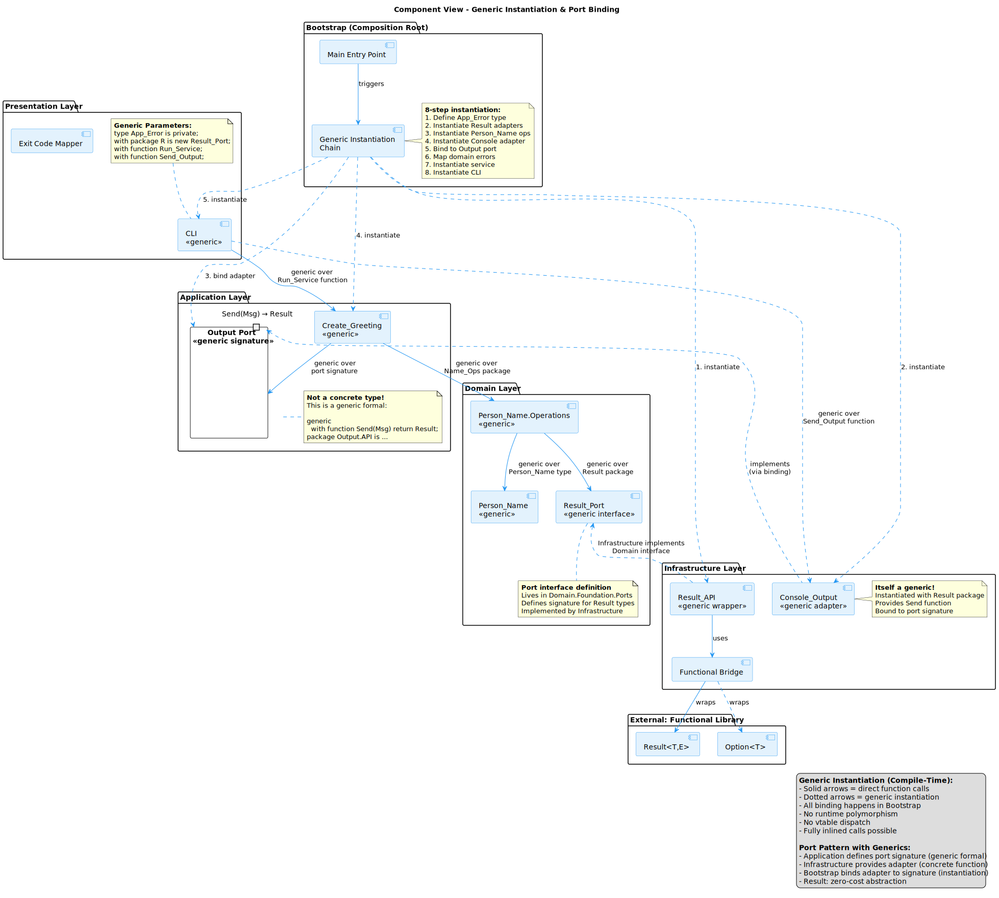

# Infrastructure Layer Guide

**Version:** 1.0.0-rc2  
**Date:** November 16, 2025  
**SPDX-License-Identifier:** BSD-3-Clause
**License File:** See LICENSE file in the project root.
**Copyright:** © 2025 Michael Gardner, A Bit of Help, Inc.  
**Status:** Unreleased  

## What is the Infrastructure Layer?

The Infrastructure Layer is where **the rubber meets the road** - it handles all the "dirty" technical details that the pure Domain Layer avoids. This includes databases, file systems, console I/O, external APIs, logging, and any other interaction with the outside world.

**Core Principle**: The Infrastructure Layer:
- **Implements ports** defined by the Application Layer
- **Depends on Application + Domain** (never the reverse!)
- **Handles all I/O operations** - file, network, console, database
- **Provides concrete adapters** that can be swapped out



## Key Responsibilities

### 1. Implement Output Ports (Adapters)

The Application Layer defines what it needs (ports/interfaces). Infrastructure provides the implementations (adapters):

```ada
-- Application Layer defines the port
package Hybrid.Application.Port.Output is
   type Output_Port is interface;
   procedure Write_Output (Self : Output_Port; Message : String) is abstract;
end Hybrid.Application.Port.Output;

-- Infrastructure Layer implements it
package Hybrid.Infrastructure.Adapter.Console_Output is
   type Console_Output is new Output_Port with null record;

   procedure Write_Output (Self : Console_Output; Message : String);
end Hybrid.Infrastructure.Adapter.Console_Output;
```

### 2. Handle External Integrations

All communication with external systems:
- **Console I/O** - Ada.Text_IO
- **File Systems** - Ada.Directories, Ada.Streams
- **Databases** - SQL connections
- **Network** - HTTP clients, sockets
- **External APIs** - REST, GraphQL, etc.

### 3. Transform Errors

Convert low-level technical errors to Application-level errors:

```ada
--  Modern approach: Use Functional.Try to bridge exceptions to Results
with Functional.Try;

function Write_To_File (Filename : String; Content : String)
   return File_Result.Result is

   --  Raw I/O that may raise exceptions
   function Raw_Write return Unit_Type is
   begin
      Ada.Text_IO.Put_Line (File, Content);
      return Unit;
   end Raw_Write;

   --  Map exceptions to domain errors
   function From_Exception (Occ : Exception_Occurrence) return Error_Type is
      use Ada.IO_Exceptions;
   begin
      if Exception_Identity (Occ) = Name_Error'Identity then
         return (File_Not_Found, "File does not exist");
      elsif Exception_Identity (Occ) = Use_Error'Identity then
         return (Permission_Denied, "Cannot write to file");
      else
         return (IO_Error, Exception_Message (Occ));
      end if;
   end From_Exception;

   --  Bridge: exceptions → Result
   function Try_Write is new Functional.Try.Try_To_Result
     (T             => Unit_Type,
      E             => Error_Type,
      Result_Type   => File_Result.Result,
      Ok            => File_Result.Ok,
      Err           => File_Result.From_Error,
      Map_Exception => From_Exception,
      Action        => Raw_Write);
begin
   return Try_Write;
end Write_To_File;
```

## Infrastructure Layer Structure

```
infrastructure/
├── infrastructure.gpr                -- Depends on application.gpr + domain.gpr
└── src/
    ├── hybrid-infrastructure.ads     -- Root package
    ├── adapter/
    │   ├── hybrid-infrastructure-adapter.ads
    │   └── console/
    │       ├── hybrid-infrastructure-adapter-console_output.ads
    │       └── hybrid-infrastructure-adapter-console_output.adb
    ├── logger/
    │   ├── hybrid-infrastructure-logger.ads
    │   ├── hybrid-infrastructure-logger.adb
    │   ├── hybrid-infrastructure-logger-concurrent.ads
    │   └── hybrid-infrastructure-logger-concurrent.adb
    ├── hybrid-infrastructure-error_transform.ads
    ├── hybrid-infrastructure-error_transform.adb
    ├── hybrid-infrastructure-task_supervisor.ads
    ├── hybrid-infrastructure-task_supervisor.adb
    ├── hybrid-infrastructure-concurrent.ads
    └── hybrid-infrastructure-concurrent.adb
```

## Implementing an Adapter

Let's implement the Console Output adapter step by step:

### Step 1: Application Defines the Port

```ada
-- application/src/port/hybrid-application-port-output.ads

package Hybrid.Application.Port.Output is
   type Output_Port is interface;

   procedure Write_Output
      (Self    : Output_Port;
       Message : String) is abstract;
end Hybrid.Application.Port.Output;
```

### Step 2: Infrastructure Implements the Adapter

**Specification (.ads):**
```ada
-- infrastructure/src/adapter/console/hybrid-infrastructure-adapter-console_output.ads

with Hybrid.Application.Port.Output;

package Hybrid.Infrastructure.Adapter.Console_Output is

   type Console_Output is new Application.Port.Output.Output_Port
      with null record;

   overriding procedure Write_Output
      (Self    : Console_Output;
       Message : String);

end Hybrid.Infrastructure.Adapter.Console_Output;
```

**Implementation (.adb):**
```ada
-- infrastructure/src/adapter/console/hybrid-infrastructure-adapter-console_output.adb

with Ada.Text_IO;

package body Hybrid.Infrastructure.Adapter.Console_Output is

   procedure Write_Output
      (Self    : Console_Output;
       Message : String) is
   begin
      Ada.Text_IO.Put_Line (Message);  -- The actual I/O!
   end Write_Output;

end Hybrid.Infrastructure.Adapter.Console_Output;
```

**That's it!** The adapter is just a thin wrapper around the technical detail.

### Why This Pattern?

```ada
-- Application code stays the same regardless of adapter:
procedure Execute (Name : Person_Name; Output : in out Output_Port'Class) is
begin
   Output.Write_Output ("Hello, " & Name.To_String);
end Execute;

-- Can use Console adapter:
Console : Console_Output;
Execute (Name, Console);

-- Or File adapter:
File : File_Output;
Execute (Name, File);

-- Or Test mock:
Mock : Mock_Output;
Execute (Name, Mock);

-- Application code doesn't change!
```

## Common Infrastructure Components

### 1. Logger

Structured logging with multiple implementations:

**Synchronous Logger:**
```ada
package Hybrid.Infrastructure.Logger is

   type Log_Level is (Debug, Info, Warning, Error);

   procedure Log
      (Level   : Log_Level;
       Message : String;
       Context : String := "");

end Hybrid.Infrastructure.Logger;
```

**Concurrent Logger (Thread-Safe):**
```ada
package Hybrid.Infrastructure.Logger.Concurrent is

   protected Logger is
      procedure Log
         (Level   : Log_Level;
          Message : String;
          Context : String := "");
   private
      Last_Message : Unbounded_String;
   end Logger;

end Hybrid.Infrastructure.Logger.Concurrent;
```

**Usage:**
```ada
-- Synchronous
Logger.Log (Info, "Processing user", Context => "UserService");

-- Concurrent (thread-safe)
Logger.Concurrent.Logger.Log (Info, "Task started", Context => "Worker");
```

### 2. Error Transform

Converts between error types:

```ada
-- infrastructure/src/hybrid-infrastructure-error_transform.ads

package Hybrid.Infrastructure.Error_Transform is

   function To_Application_Error
      (Error : Domain.Error.Domain_Error)
      return Application.Error.Application_Error;

   function To_Exit_Code
      (Error : Application.Error.Application_Error)
      return Presentation.Exit_Code.Exit_Code;

end Hybrid.Infrastructure.Error_Transform;
```

**Implementation:**
```ada
function To_Application_Error
   (Error : Domain.Error.Domain_Error)
   return Application.Error.Application_Error is
begin
   case Error is
      when Domain.Error.Empty_Person_Name =>
         return Application.Error.Invalid_Input;
      when Domain.Error.Person_Name_Too_Long =>
         return Application.Error.Invalid_Input;
      when Domain.Error.Invalid_Person_Name =>
         return Application.Error.Domain_Error_Occurred;
      when others =>
         return Application.Error.Domain_Error_Occurred;
   end case;
end To_Application_Error;
```

### 3. Task Supervisor

Manages concurrent operations:

```ada
package Hybrid.Infrastructure.Task_Supervisor is

   task type Worker_Task is
      entry Start (ID : Natural);
      entry Stop;
   end Worker_Task;

   type Worker_Array is array (Positive range <>) of Worker_Task;

   procedure Supervise_Workers
      (Workers : in out Worker_Array;
       Timeout : Duration := 10.0);

end Hybrid.Infrastructure.Task_Supervisor;
```

**Usage:**
```ada
Workers : Worker_Array (1 .. 4);
begin
   -- Start all workers
   for I in Workers'Range loop
      Workers (I).Start (I);
   end loop;

   -- Supervise with timeout
   Task_Supervisor.Supervise_Workers (Workers, Timeout => 30.0);
end;
```

## Adapter Patterns

### Multiple Implementations of Same Port

```ada
-- Console adapter
type Console_Output is new Output_Port with null record;
procedure Write_Output (Self : Console_Output; Message : String);

-- File adapter
type File_Output is new Output_Port with record
   Filename : Unbounded_String;
end record;
procedure Write_Output (Self : File_Output; Message : String);

-- Network adapter
type HTTP_Output is new Output_Port with record
   URL : Unbounded_String;
end record;
procedure Write_Output (Self : HTTP_Output; Message : String);
```

All implement the same interface, so they're interchangeable!

### Configuration-Based Selection

```ada
function Create_Output_Adapter (Config : String) return Output_Port'Class is
begin
   if Config = "console" then
      return Console_Output'(null record);
   elsif Config = "file" then
      return File_Output'(Filename => To_Unbounded_String ("output.txt"));
   elsif Config = "http" then
      return HTTP_Output'(URL => To_Unbounded_String ("https://api.example.com"));
   else
      raise Constraint_Error with "Unknown adapter: " & Config;
   end if;
end Create_Output_Adapter;
```

## Testing Infrastructure

### Unit Tests (Adapter Behavior)

```ada
-- tests/unit/src/infrastructure/test_infrastructure_adapter_console_output.adb

procedure Test_Console_Output_Writes_Message is
   Adapter : Console_Output;
begin
   -- This actually writes to console during test
   -- Usually we'd redirect stdout for testing
   Adapter.Write_Output ("Test message");

   -- In real tests, you'd capture stdout and verify
   Assert (True, "Should not raise exception");
end Test_Console_Output_Writes_Message;
```

### Integration Tests (Adapters + Ports)

```ada
-- tests/integration/src/test_integration_output_adapters.adb

procedure Test_All_Adapters_Implement_Port is
   Console : Console_Output;
   File    : File_Output;
begin
   -- All should compile and work polymorphically
   Test_Adapter (Console);
   Test_Adapter (File);
end Test_All_Adapters_Implement_Port;

procedure Test_Adapter (Adapter : in out Output_Port'Class) is
begin
   Adapter.Write_Output ("Test");
   Assert (True, "Adapter should work polymorphically");
end Test_Adapter;
```

## Concurrency in Infrastructure

### Protected Objects

For thread-safe state:

```ada
protected type Counter is
   procedure Increment;
   function Get_Value return Natural;
private
   Value : Natural := 0;
end Counter;

protected body Counter is
   procedure Increment is
   begin
      Value := Value + 1;
   end Increment;

   function Get_Value return Natural is
   begin
      return Value;
   end Get_Value;
end Counter;
```

### Tasks

For concurrent operations:

```ada
task type Worker is
   entry Start (Job : Job_Data);
   entry Get_Result (Result : out Job_Result);
end Worker;

task body Worker is
   Current_Job    : Job_Data;
   Current_Result : Job_Result;
begin
   accept Start (Job : Job_Data) do
      Current_Job := Job;
   end Start;

   -- Process job (may take time)
   Current_Result := Process (Current_Job);

   accept Get_Result (Result : out Job_Result) do
      Result := Current_Result;
   end Get_Result;
end Worker;
```

## Common Mistakes to Avoid

### ❌ Don't: Let Domain/Application Depend on Infrastructure

```ada
-- WRONG: Domain depending on Infrastructure
with Hybrid.Infrastructure.Logger;  -- NO!

package Hybrid.Domain.Service.Greeting is
   procedure Create_Greeting (Name : Person_Name);
end Hybrid.Domain.Service.Greeting;
```

**Why?** Violates dependency rule. Domain should be pure.

### ❌ Don't: Put Business Logic in Adapters

```ada
-- WRONG: Business logic in adapter
procedure Write_Output (Self : Console_Output; Message : String) is
begin
   if Message'Length > 100 then  -- Business rule! Belongs in Domain
      Ada.Text_IO.Put_Line ("Error: Message too long");
      return;
   end if;

   Ada.Text_IO.Put_Line (Message);
end Write_Output;
```

**Why?** Adapters are thin wrappers. Business rules belong in Domain.

### ❌ Don't: Expose Infrastructure Types to Application

```ada
-- WRONG: Returning infrastructure type
function Get_Database_Connection return Ada.Database.Connection;  -- NO!

-- RIGHT: Hide behind port/interface
type Database_Port is interface;
procedure Execute_Query (Self : Database_Port; SQL : String) is abstract;
```

**Why?** Application shouldn't know about database connections.

### ❌ Don't: Create God Objects

```ada
-- WRONG: One adapter does everything
type Super_Adapter is new Output_Port with record
   Console_Handle  : Console_Handle;
   File_Handle     : File_Handle;
   Database_Handle : Database_Handle;
   HTTP_Client     : HTTP_Client;
   Logger          : Logger;
end record;
```

**Why?** Single Responsibility Principle. One adapter, one job.

## Performance Considerations

### 1. Connection Pooling

```ada
protected Connection_Pool is
   procedure Get_Connection (Conn : out Database_Connection);
   procedure Return_Connection (Conn : Database_Connection);
private
   Available : Connection_Array (1 .. 10);
   Count     : Natural := 10;
end Connection_Pool;
```

### 2. Buffered I/O

```ada
type Buffered_Output is new Output_Port with record
   Buffer   : Unbounded_String;
   Max_Size : Natural := 4096;
end record;

procedure Write_Output (Self : in out Buffered_Output; Message : String) is
begin
   Append (Self.Buffer, Message & ASCII.LF);

   if Length (Self.Buffer) >= Self.Max_Size then
      Flush (Self);
   end if;
end Write_Output;
```

### 3. Async I/O

```ada
task type Async_Writer is
   entry Write (Message : String);
   entry Flush;
end Async_Writer;

-- Caller doesn't block on I/O
Writer.Write ("Message");  -- Returns immediately
```

## Summary

The Infrastructure Layer is the **technical implementation layer**:

- **Implements ports** defined by Application
- **Handles all I/O** - console, file, network, database
- **Depends on Application + Domain** (not the reverse!)
- **Provides swappable adapters** - easy to change implementations
- **Transforms errors** - technical → application-level
- **Manages concurrency** - tasks, protected objects

**Remember**: Infrastructure is where technical details live. Keep it thin, focused, and swappable.

## Next Steps

- **[Application Layer Guide](application-layer.md)** - Understand ports and use cases
- **[Presentation Layer Guide](presentation-layer.md)** - Learn about input adapters
- **[Concurrency Guide](concurrency.md)** - Deep dive into Ada tasking

## References

- `infrastructure/` - Infrastructure layer source code
- `tests/unit/src/infrastructure/` - Infrastructure unit tests
